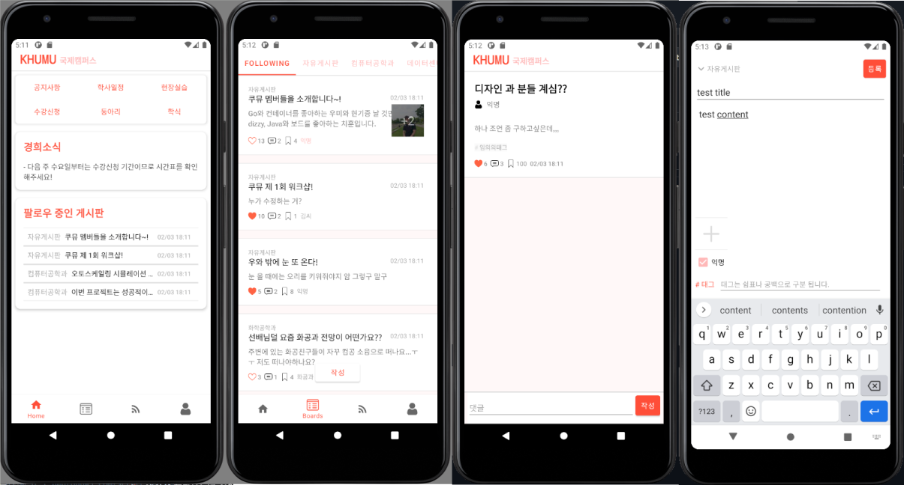

# khumu-android

`khumu-android`는 쿠뮤의 서비스를 안드로이드 앱으로 제공하는 프로젝트이다. 유지보수가 힘든 날것의 개발보다는 MVVM pattern과 클린아키텍쳐를 적용함으로써 계층을 분리했고 보다 유지보수가 쉬운 형태로 발전해나가고 있다. Dagger2, Retrofit과 같은 framework과 library들을 적절히 도입하여 반복되는 코드를 줄여 편리하고 가독성 좋게 개발하려고 노력하고 있다.



## MVVM

MVVM은 Model, View, ViewModel의 줄임말이다. 간단히 하자면 Model은 비즈니스 로직과 데이터, 뷰는 UI와 UI로직, 뷰 모델은 프레젠테이션 로직과 뷰를 위한 상태를 다룬다. 

- 사용자의 Action은 View로 들어온다.
- View가 필요한 데이터는 ViewModel에서 얻는다.
- View와 Model의 의존성은 없다.

## 클린 아키텍쳐

안드로이드에서의 클린 아키텍쳐는 크게

- Presentation Layer
- Domain Layer
- Data Layer

이 세가지 계층으로 나뉜다.


우리는 이 계층을 가지고 우리 프로젝트에 다음과 같이 적용하였다.

### 프로젝트 구조

```
├─articleDetail
├─articleWrite
├─boardsDialog
├─data
│  └─rest
├─feed
├─home
├─login
├─myPage
├─notifications
├─repository
│  └─retrofit
├─signUp
└─util
```

프로젝트 구조는 위와 같이 되어 있다.

파트를 나눠 설명하자면

- Presentation Layer
    - 뷰와 뷰모델인 메인 화면(home), 게시판(feed), 게시글 작성(articleWrite), 게시글 및 댓글(articleDetail), 마이페이지(myPage), 로그인(login), 회원가입(signUp) 등 어플리케이션에서 사용되는 뷰(activity, frament, adapter...)와 프레젠터(ViewModel)가 각각의 패키지 안에 있다.
- Domain Layer
    - 아직까지는 UseCase를 도입할만큼 비즈니스 로직의 양이 많지 않아 Repository와 ViewModel에 흡수시켰다.
- Data Layer
    - 데이터 저장/수정 등의 기능을 제공하는 Repository와 그 안의 retrofit패키지에 retrofit에 관련된 요소들을 넣었다.

### Dagger2를  통한 의존성 주입

기본적으로 내부에 속한 요소는 외부에 속한 어떤 것도 알지 못해야하기(의존성 규칙) 때문에 의존성 주입이 필요하다. 클린 아키텍쳐를 android에 적용하기 위해 필요한 것이 바로 DI(Dependency Injection)이다.

저희 Khumu 팀은 현재 DI framework로 Dagger2를 사용하고 있다. Dagger2를 사용함으로 클래스 간의 결합도를 줄여 코드가 유연해지고 보일러 플레이트 코드가 감소하였다.

### Retrofit

저희 Khumu 팀은 현재 Http 통신을 위한 HttpClient 라이브러리로 Retrofit을 사용하고 있다.

Retrofit을 사용함으로 통신 기능에 사용되는 보일러플레이트 코드가 줄어들었고 코드의 가독성이 뛰어나졌습니다. 


## 개발 시 주의사항

* Adapter에 반응은 하는데 UI 업데이트는 제대로 이루어지지않거나 Observer가 onChanged에서 이벤트를 다 받지 못하는 경우
  * Adapter가 ListView나 RecyclerView에 제대로 Adapter로 등록되지 않았을 수 있다.

* ViewModel의 LiveData가 변경되어도 Observer가 이벤트를 감지할 수 없는 경우.
  * Observer가 Listen 중인 ViewModel의 LiveData가 아닌 다른 ViewModel의 LiveData를 조작하는 경우 동일한 LiveData를 이용하지 않기 때문임.

    ViewModel을 올바르게 생성하거나 전달받지 못한 경우 이런 현상이 발생.
